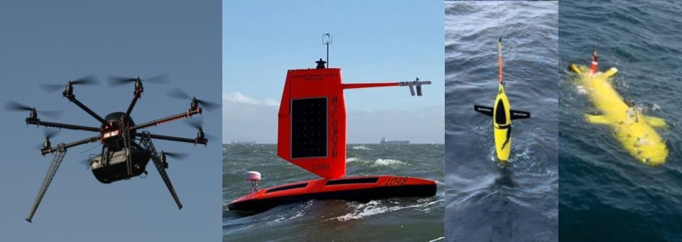

# UxS Data Community of Practice

The UxS Data CoP is a community of practice for the uncrewed sytems community. This repository is designed to be a library of sorts that contains standard operating procedures, policy documentation, metadata profiles, and documentation related to the formation of the community itself. Dcoumentation will be updated periodically as consensus is formed within the community. If you have documentation you would like to share with the UxS Data CoP or would like to be added to our mailing list, please email (andrew.evans@noaa.gov)

# Purpose and Scope
The Uncrewed Systems (UxS) Data Community of Practice (CoP) is established for the purpose of providing a forum for the standardization of data practices, data management protocols, and vocabularies related to UxS data. This forum will enhance inter- and intra agency collaboration, as well as foster relationships within state, academia, and industry stakeholders. 

# Background
Over the last decade, the use of uncrewed systems for the collection of data has increased exponentially. During this time, the focus has been on the improvement of the sensors, platform endurance, and multi-mission payload technologies. As a result, the amount of data collected by UxS has increased 10 fold overwhelming much of the current system architecture that handles environmental data. There is also a lack of formal or published data formats, minimum metadata, and common vocabulary. This community of practice seeks to improve and harmonize UxS data science to improve the findability, accessibility, interoperability, and reusability of UxS data. The UxS Data CoP will serve the UxS community across federal and state governments, and academic institutional partners in collaboration with industry stakeholders to formalize metadata practices, identify common data formats, and standardize vocabulary used. .

# Definition of Uncrewed Systems
Uncrewed systems are remotely operated or autonomous platforms that can perform its mission without an onboard human presence and may include operational components such as control and communication and scientific instruments. Uncrewed systems include platforms that can operate in one or more of the following domains: underwater, surface of the water, aerial, and terrestrial.  The CoP’s use of the term "uncrewed system" includes the following nomenclature: "remotely piloted systems," "remotely operated vehicles," "unmanned systems," "unmanned vehicles," "autonomous systems," "autonomous vehicles," and variants including "unmanned surface vehicles/systems," "unmanned underwater vehicles/systems," "unmanned aircraft vehicles/systems," autonomous surface vehicles/systems," "autonomous underwater vehicles/systems," and "autonomous aircraft vehicles/systems." The CoP’s use of the term "uncrewed systems" does not encompass satellites, weather balloons, or buoys.

# Goals:
Foster collaboration across government agencies, academic institutions, and industry partners
Share and promote best practices for data management and stewardship of UxS data to enhance the Findability, Accessibility, Interoperability, and Reusability (FAIR) of UxS Data
Promote commonality across domains for data formatting, vocabulary, and metadata

# Objectives:
Quarterly meetings between stakeholders at partner institutions to identify current issues facing the management of UxS data
Development of standardized metadata template across aerial, terrestrial, and maritime domains
Publish quarterly newsletter to inform stakeholders of new technologies, data management practices, and upcoming presentations of relevance

# Outcomes:
Unified metadata standards across the UxS community
Fixed vocabularies for making UxS data FAIR
Documentation of best practices for all UxS domains

#
# Editing this README

When you're ready to make this README your own, just edit this file and use the handy template below (or feel free to structure it however you want - this is just a starting point!). Thanks to [makeareadme.com](https://www.makeareadme.com/) for this template.

## Suggestions for a good README

Every project is different, so consider which of these sections apply to yours. The sections used in the template are suggestions for most open source projects. Also keep in mind that while a README can be too long and detailed, too long is better than too short. If you think your README is too long, consider utilizing another form of documentation rather than cutting out information.

## Name
Choose a self-explaining name for your project.

## Description
Let people know what your project can do specifically. Provide context and add a link to any reference visitors might be unfamiliar with. A list of Features or a Background subsection can also be added here. If there are alternatives to your project, this is a good place to list differentiating factors.

## Badges
On some READMEs, you may see small images that convey metadata, such as whether or not all the tests are passing for the project. You can use Shields to add some to your README. Many services also have instructions for adding a badge.

## Visuals
Depending on what you are making, it can be a good idea to include screenshots or even a video (you'll frequently see GIFs rather than actual videos). Tools like ttygif can help, but check out Asciinema for a more sophisticated method.

